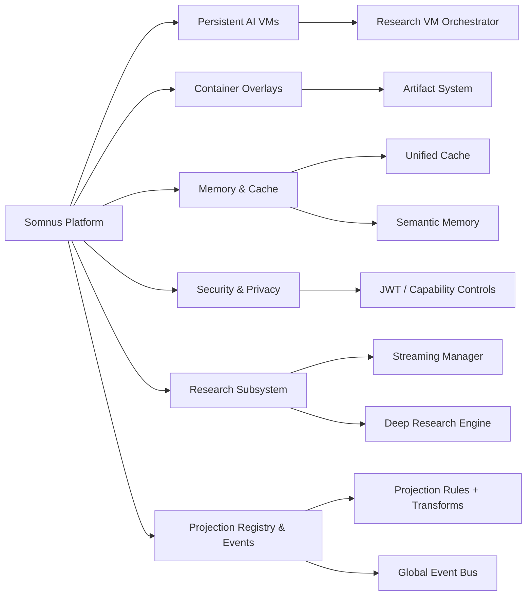

# Somnus Diagram Library

This directory contains extensive diagrams (Mermaid) covering core and advanced subsystems. These are additive to the main README.

- Research Streaming Protocol: docs/diagrams/research_streaming.md
- Research VM Orchestrator: docs/diagrams/research_vm_orchestrator.md
- Projection Registry & Global Events: docs/diagrams/projections_and_events.md
- Security & Privacy Flows: docs/diagrams/security_privacy.md
- Cache & Memory Architecture: docs/diagrams/cache_memory.md
- Artifact System & Container Overlays: docs/diagrams/artifact_system.md

## Overview Map



## PNG generation (fallback images)

If your environment does not render Mermaid natively, generate PNGs:

```
npm install -g @mermaid-js/mermaid-cli@10
python scripts/render_mermaid.py --format png --theme default
```

Images will be written to docs/diagrams/img as <docbase>__blockNN.png.

Make usage:
- make diagrams       # PNG
- make diagrams-svg   # SVG
- make diagrams-clean # cleanup

## Legend
- Solid boxes: Core subsystems
- Hollow boxes: Subcomponents
- Clickable links jump to deep-dive diagrams

