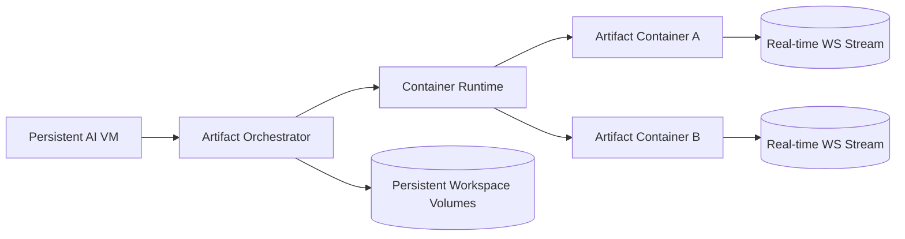
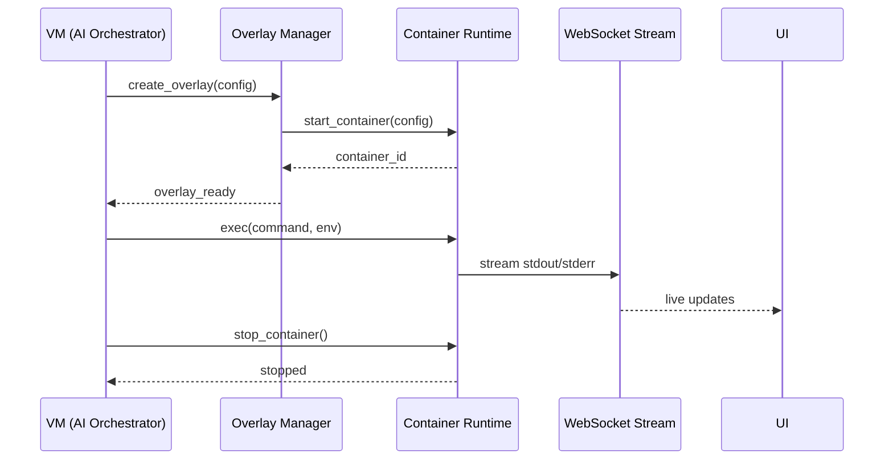
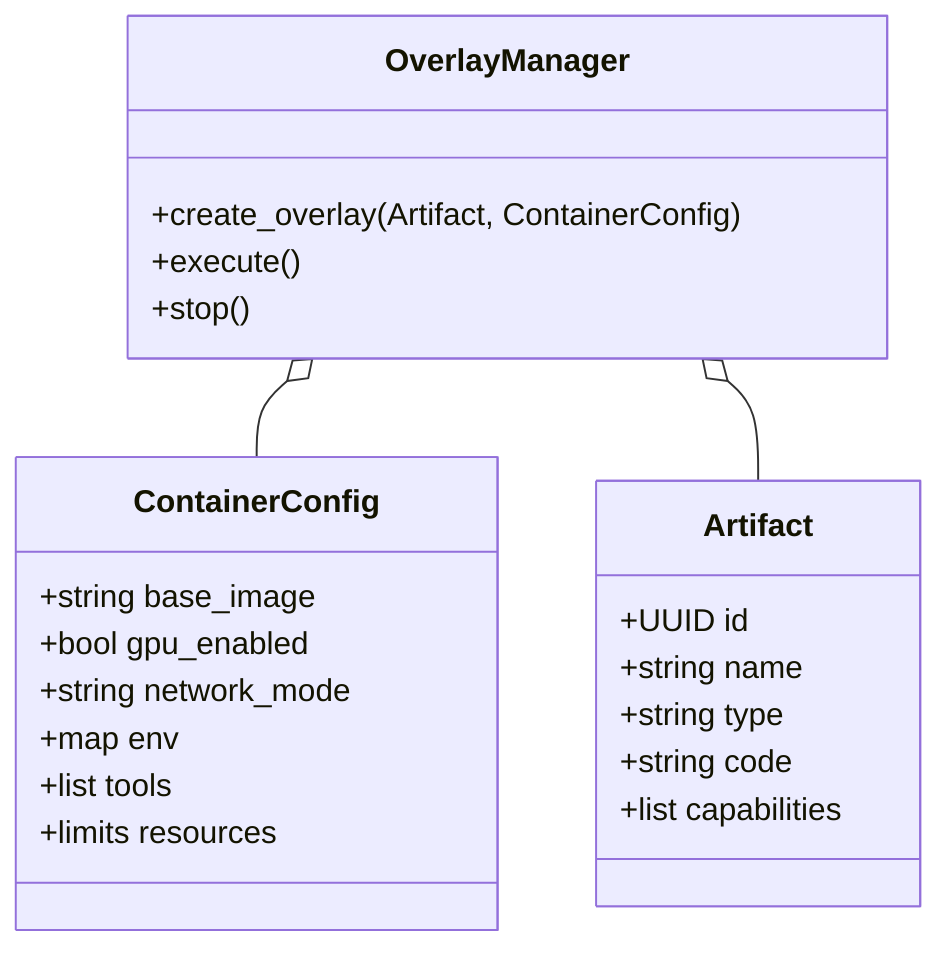
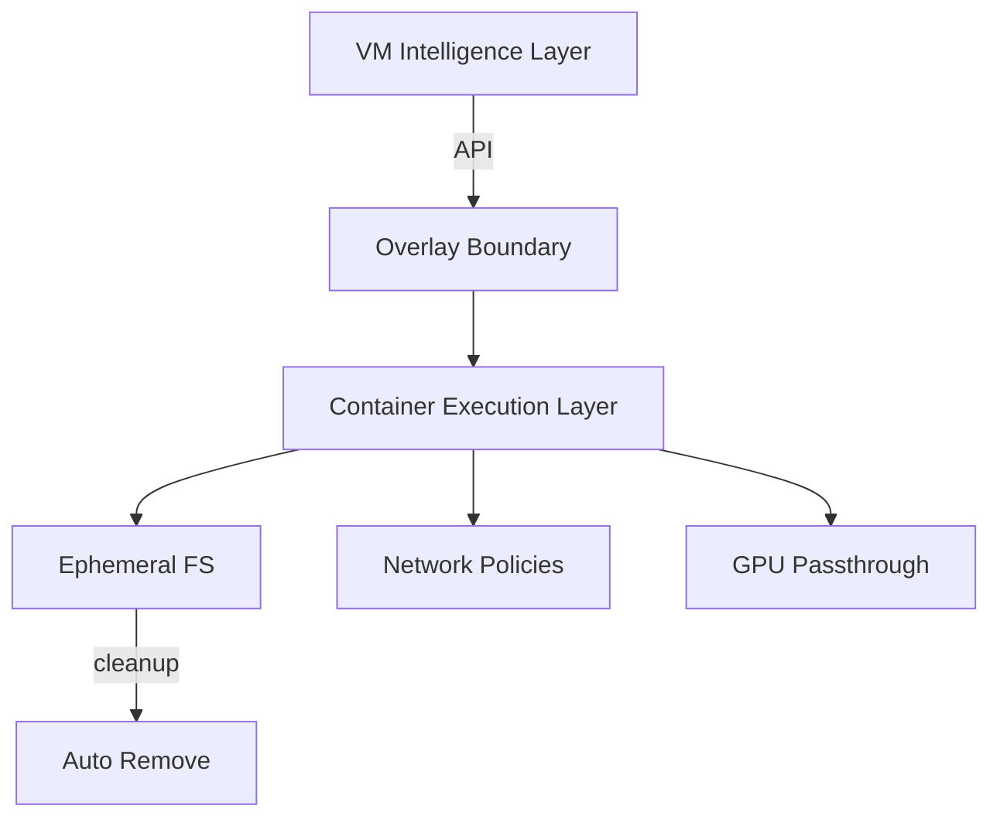

# Artifact System & Container Overlays — Diagrams

Unlimited execution via disposable containers per artifact.

## Component Architecture

## Sequence: Artifact Execution

## Class Diagram: Overlay/Artifact Config

## Flowchart: Security Separation

