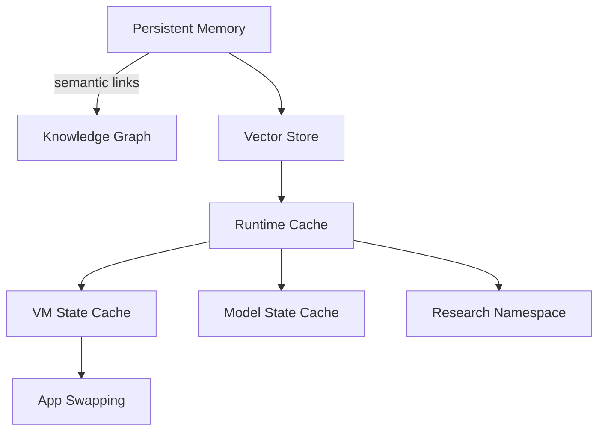
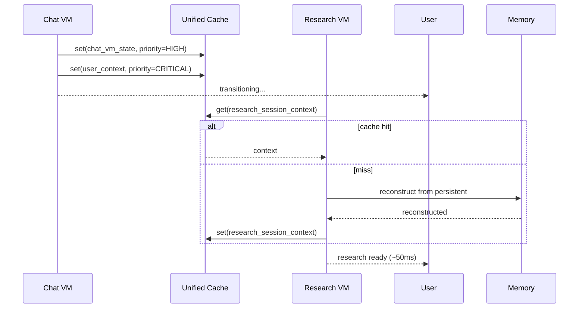
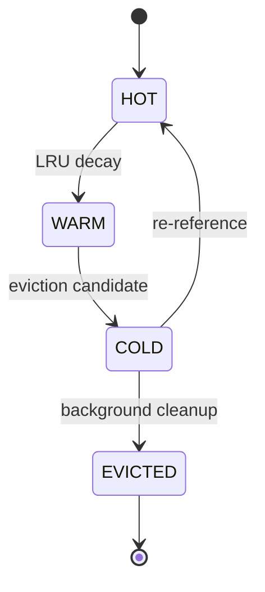

# Cache & Memory Architecture — Diagrams

Unified memory+cache with app swapping and background persistence.

## Layered Architecture

## Sequence: App Swapping with Cache

## State Diagram: Cache Entry Lifecycle

## Gantt: Background Tasks

```mermaid
gantt
  title Cache & Memory Background Processes
  dateFormat  X
  axisFormat  %s
  section Cache
  Eviction Sweep       :done,    e1, 0, 20
  Persistence Flush    :active,  e2, 5, 30
  section Memory
  Consolidation        :         m1, 10, 25
  Importance Decay     :         m2, 15, 10
```

## PNG Fallbacks
- docs/diagrams/img/cache_memory__block01.png (Layered Architecture)
- docs/diagrams/img/cache_memory__block02.png (Sequence: App Swapping)
- docs/diagrams/img/cache_memory__block03.png (State: Cache Entry)
- docs/diagrams/img/cache_memory__block04.png (Gantt: Background Tasks)

