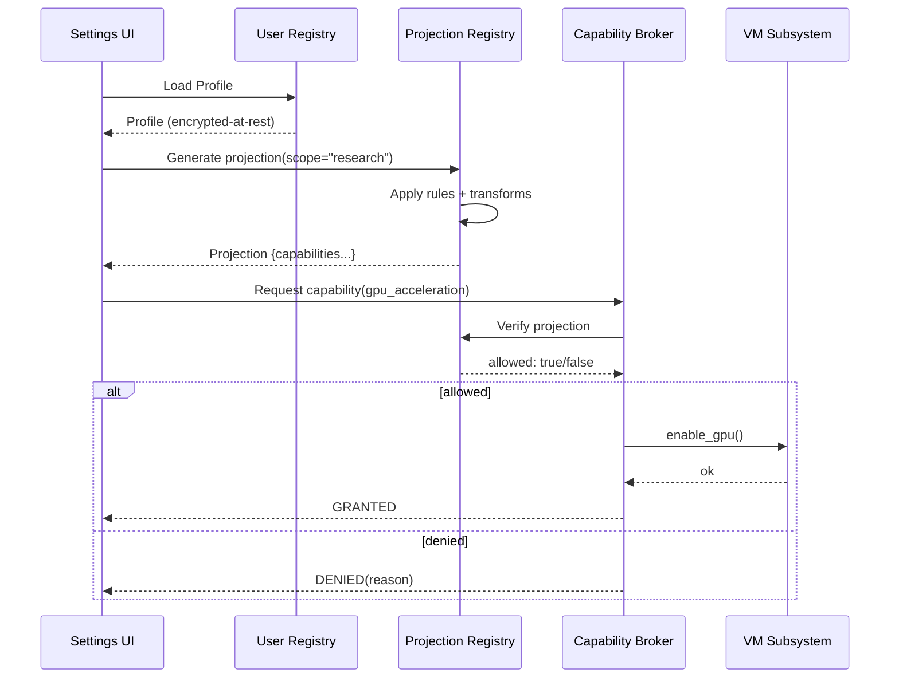
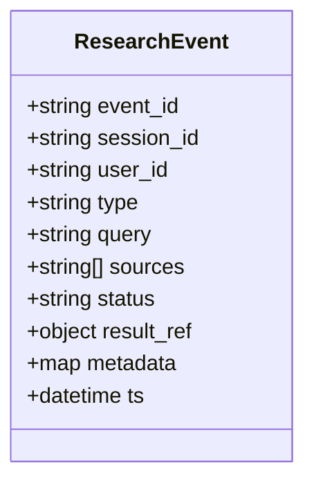
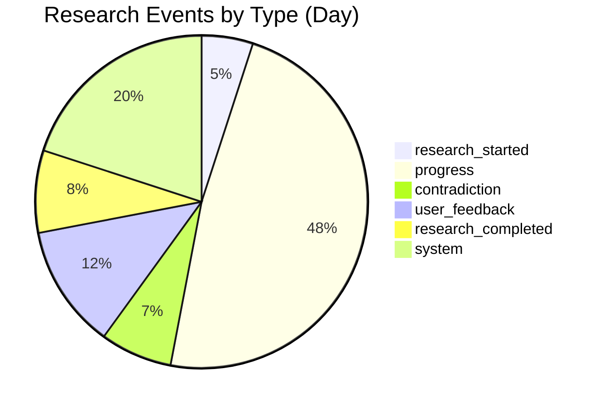

# Projection Registry & Global Events — Diagrams

Privacy-preserving capability projections and event bus flows.

## Flow: Capability Projection from User Registry

```mermaid
flowchart LR
  UPR[User Registry (encrypted)] --> PR[Projection Registry]
  PR --> TF[Transform Rules]
  TF --> CAP[Capability Graph]
  CAP --> BROK[Capability Broker]
  BROK --> VM[VM/Research/Artifact Subsystems]
  BROK --> DENY{Denied?}
  DENY -- Yes --> AUDIT[Audit Trail + Reason]
  DENY -- No --> GRANT[Grant Capability]
```

## Sequence: Projection Generation and Enforcement



## Requirement Diagram: Privacy and Capability Constraints

```mermaid
requirementDiagram
  requirement local_only {
    id: PRIV-001
    text: All processing must remain local by default
    risk: low
    verifymethod: test
  }
  requirement capability_abstraction {
    id: PRIV-002
    text: AI sees only capabilities, not raw personal data
    risk: medium
    verifymethod: review
  }
  requirement explicit_consent {
    id: PRIV-003
    text: Any expansion of AI visibility requires explicit user consent
    risk: medium
    verifymethod: test
  }
```

## Class Diagram: ResearchEvent Extensions



## Pie: Event Type Mix (Illustrative)



