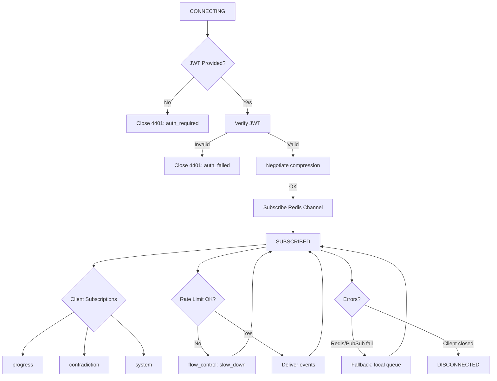
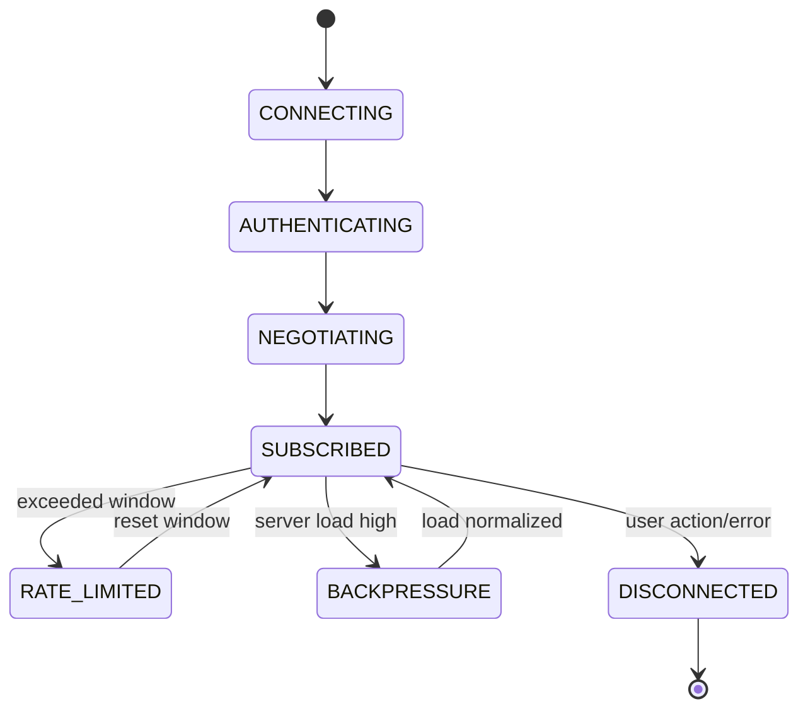
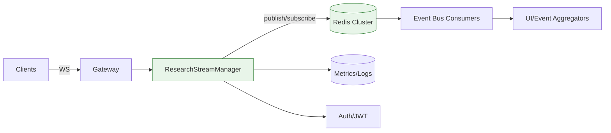
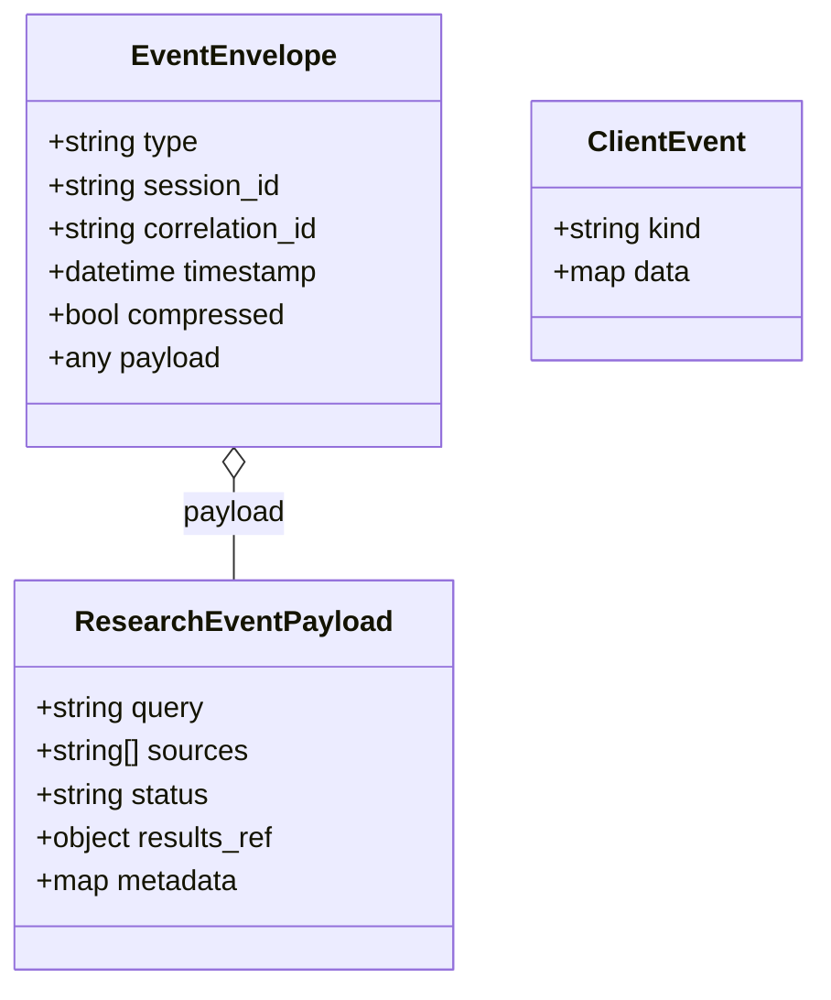
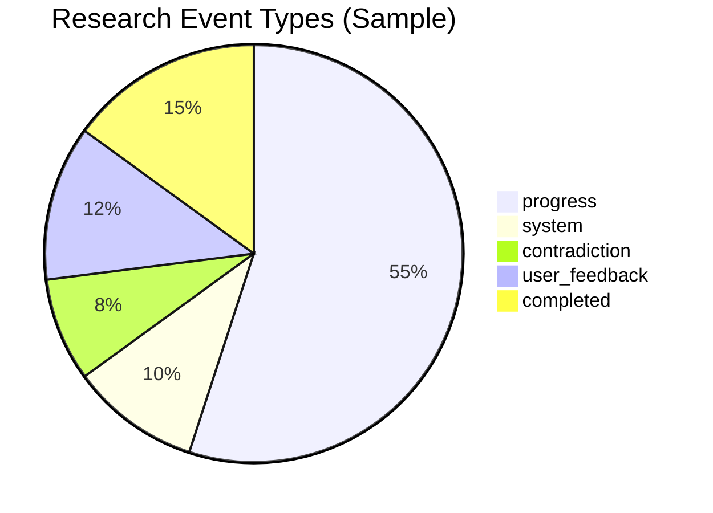

# Research Streaming Protocol — Diagrams

Comprehensive diagrams for the ResearchStreamManager (WebSocket/JWT/Compression/Redis pub-sub).

## Sequence: Client Handshake, JWT, Compression, Subscription, Broadcast

```mermaid
sequenceDiagram
    autonumber
    participant U as User Client (Browser/App)
    participant GW as Gateway/HTTP(S)
    participant SM as ResearchStreamManager
    participant JWT as JWT Verifier (pyjwt)
    participant R as Redis (Pub/Sub)
    participant SUB as Other Subscribers

    U->>GW: GET /ws/research?session_id=... (Upgrade)
    GW->>SM: WebSocket Upgrade
    SM->>U: 101 Switching Protocols
    U->>SM: Authorization: Bearer <JWT> + Accept-Compression=zlib
    par Verify JWT
        SM->>JWT: verify(token)
        JWT-->>SM: {sub: user_id, exp, scopes}
    and Negotiate Compression
        SM-->>U: compression_ack(zlib=true)
    end
    alt JWT invalid or expired
        SM-->>U: error(auth_failed)
        SM->>U: close(4401)
        deactivate SM
    else JWT valid
        SM->>R: SUBSCRIBE research:session:<session_id>
        SM-->>U: subscription_ack(session_id, rate_limit, heartbeat=event)
    end

    rect rgb(240,250,240)
    Note over U,SM: Streaming Phase
    U->>SM: subscribe(events=[progress,contradiction,system])
    SM-->>U: event(research_started,...)
    R-->>SM: PUBLISH(research:session:<session_id>, event:progress)
    SM-->>U: event(progress, payload=compressed?)
    loop rate-limit window
        U->>SM: client_event(user_feedback)
        SM-->>U: ack(client_event_id)
    end
    end

    par Broadcast to others
        R-->>SUB: event(progress)
        SUB-->>Users: forward/update UI
    and Heartbeat
        SM-->>U: event(connection_status: healthy, ts)
    end

    alt server backpressure
        SM-->>U: event(flow_control: slow_down)
        U->>SM: adjust_rate()
    end

    alt research_completed
        R-->>SM: event(research_completed, results_ref)
        SM-->>U: event(research_completed, results_ref)
        SM->>U: close(1000)
    end
```

## Flowchart: Connection Lifecycle, Errors, Recovery



## State Diagram: Connection States



## Component Map: Streaming Architecture



## Class Diagram: Event Types and Envelope



## Pie: Event Distribution (Example)



## PNG Fallbacks
- docs/diagrams/img/research_streaming__block01.png (Sequence: Handshake/JWT/Compression)
- docs/diagrams/img/research_streaming__block02.png (Flowchart: Lifecycle/Errors)
- docs/diagrams/img/research_streaming__block03.png (State: Connection States)
- docs/diagrams/img/research_streaming__block04.png (Component Map)
- docs/diagrams/img/research_streaming__block05.png (Class: Envelopes)
- docs/diagrams/img/research_streaming__block06.png (Pie: Event Mix)


