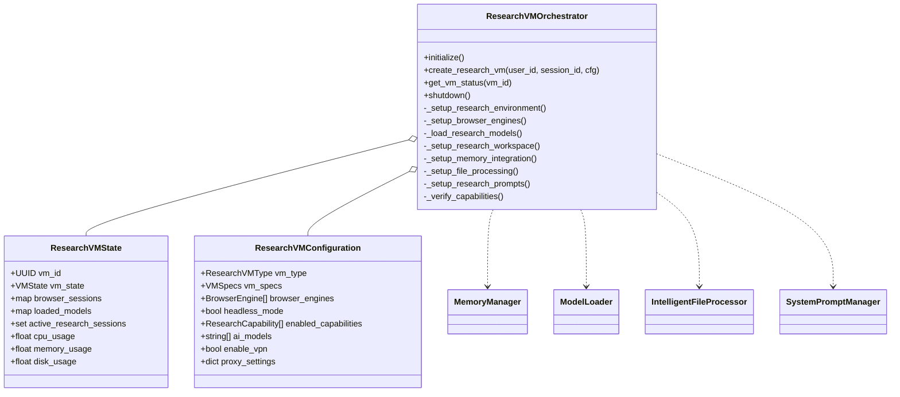
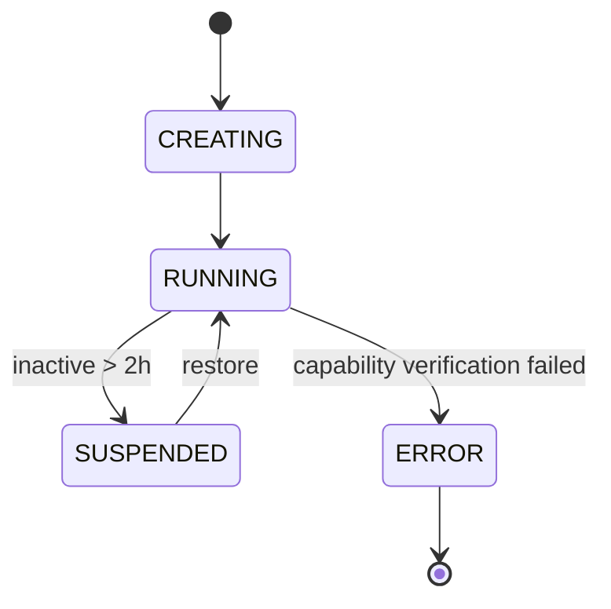
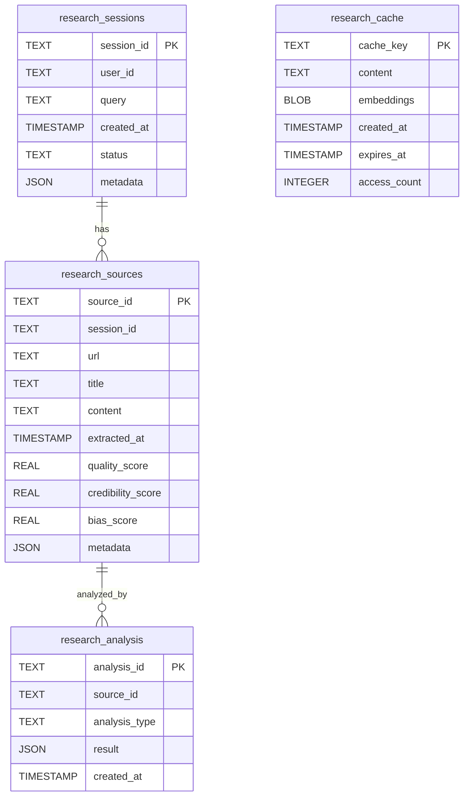
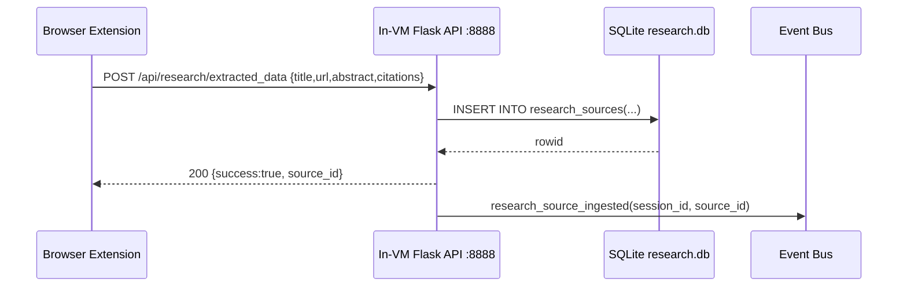

# Research VM Orchestrator — Diagrams

End-to-end view of research VM provisioning, initialization, services, and runtime loops.

## Flow: VM Initialization & Configuration

```mermaid
flowchart TD
  A[create_research_vm] --> B[Provision base VM]
  B --> C[Setup OS packages & tools]
  C --> D[Create workspace dirs]
  D --> E[Python venv + research packages]
  E --> F[Display server (Xvfb)]
  F --> G[Browser engines (Chromium/Firefox)]
  G --> H[Install research extensions]
  H --> I[Load AI models]
  I --> J[Write analysis scripts]
  J --> K[Init research DB (SQLite)]
  K --> L[Start in-VM Flask API (8888)]
  L --> M[File watcher + processing]
  M --> N[Memory integration]
  N --> O[Prompt configuration]
  O --> P[Capability verification]
  P --> Q[RUNNING]
```

## Class Diagram: Orchestrator Core Types



## State Diagram: VM Lifecycle



## ER Diagram: Research Database Schema



## Sequence: Browser Extension Ingestion



## Gantt: Initialization Timeline (Example)

```mermaid
gantt
  title Research VM Initialization
  dateFormat  HH:mm
  axisFormat  %H:%M
  section System
  Packages & Tools      :done,    des1, 00:00, 00:02
  Workspace            :done,    des2, 00:02, 00:01
  Python/Deps          :active,  des3, 00:03, 00:03
  Playwright/Selenium  :         des4, 00:06, 00:02
  Browsers & Profiles  :         des5, 00:08, 00:02
  Models Load          :         des6, 00:10, 00:04
  DB Init              :         des7, 00:14, 00:01
  API Launch           :         des8, 00:15, 00:01
  Capability Verify    :         des9, 00:16, 00:02
```



