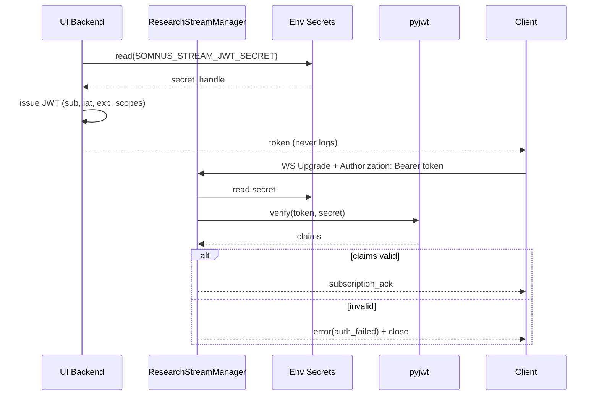
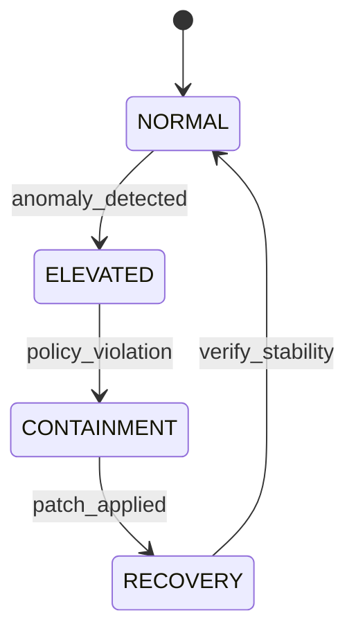

# Security & Privacy — Diagrams

Deep dive into authentication, boundaries, and privacy guarantees.

## Sequence: JWT Lifecycle for Streaming



## Boundary Diagram: Trust Zones and Data Paths

```mermaid
flowchart LR
  subgraph Host[Host Machine]
    ST[Somnus Server]
    R[(Redis Local)]
  end
  subgraph VM[Research VM]
    API[Flask API :8888]
    DB[(SQLite research.db)]
  end
  Client[Browser/App]

  Client -- WS(w/ JWT) --> ST
  ST <---> R
  ST <---> VM : control/commands
  API <---> DB
  VM -. limited .-> Host : controlled bridge
```

## Requirement Diagram: Threats and Controls

```mermaid
requirementDiagram
  requirement auth_required {
    id: SEC-001
    text: All streaming connections must authenticate when enabled
    risk: medium
    verifymethod: test
  }
  requirement compress_opt_in {
    id: SEC-002
    text: Compression only when negotiated to prevent CRIME-like risks
    risk: low
    verifymethod: analysis
  }
  requirement local_default {
    id: SEC-003
    text: All services bind to localhost by default
    risk: low
    verifymethod: inspection
  }
  requirement capability_based_access {
    id: SEC-004
    text: Access is granted via capability projections
    risk: medium
    verifymethod: review
  }
```

## State Diagram: Incident Response Levels (Illustrative)



